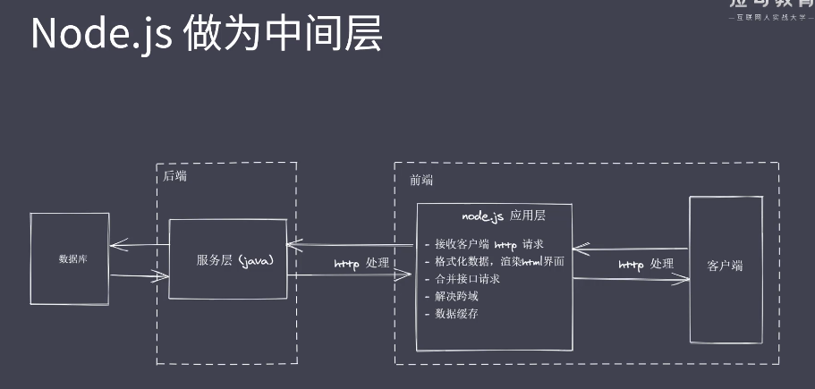

## Node 特点
1. 异步IO
2. 事件驱动
3. 事件循环
   
## Node 架构
1. Natives modules
   1. 原生模块，fs，path等可以直接使用的模块，由js语言实现
2. Node c/c++ Bindings
   1. 胶水层，js 无法实现文件的操作等功能，只能交由 c 去做
   2. 该层提供了一种映射，调用某个原生模块会找到对应的那个具体的 c 实现的功能去执行
3. 由 c 实现的核心模块
   1. v8 引擎 执行 js 代码，提供桥梁接口 将 js -> c
   2. libuv 事件循环 事件驱动 异步IO
   3. http parser 
   4. zlib
   5. ...各种功能模块

## 为什么 NodeJs
1. 多线程的处理方式，每接受一个请求就会开启一个线程处理，这种情况对于用户来说是十分友好的，他的请求可以被立即响应。
2. 但是，当并发量很大时，不可能无限增加线程来处理请求，所以这种方式是有弊端的。
3. 我们发现，在处理请求的过程中，所有的 IO 操作是比较耗时的，此时线程处于阻塞状态，无法使用，浪费资源。
4. 因此，使用单线程异步处理的方式是一种更好的解决方案，线程无需阻塞，轮流处理收到的请求，在 IO 操作完成后发送通知，告诉线程再进行后续的处理。
5. 这种单线程异步的处理方式适用于 io 密集型业务，通过异步io操作来解决。
6. 对于需要计算的 cpu 密集型业务不合适。
7. 而 Node 的单线程，异步 IO 天然适合于处理这种情况

## 异步 IO
1. IO 是应用程序的瓶颈所在
2. 异步 IO 可以提供程序性能，无需原地等待返回结果
3. IO 操作属于操作系统级别，平台都有对应的实现
4. NodeJs 单线程配合事件驱动架构以及 libuv 库实现了异步 IO

## 事件驱动架构
1. 发布订阅者模式
2. events模块 实现了事件驱动

## 单线程
1. 单线程如何实现并发
   1. 单线程 + 异步非阻塞IO + 事件回调通知
2. 所谓单线程 是指 NodeJs 主线程是单线程的 而在 libuv 中是存在多个线程来实现异步机制的
3. NodeJs 的单线程不适合处理 cpu 密集型业务

## NodeJs 应用场景
1. 处理 IO 密集型的高并发请求
   1. 
   2. 操作数据库 实现 API 服务
   3. 实时的聊天应用程序

