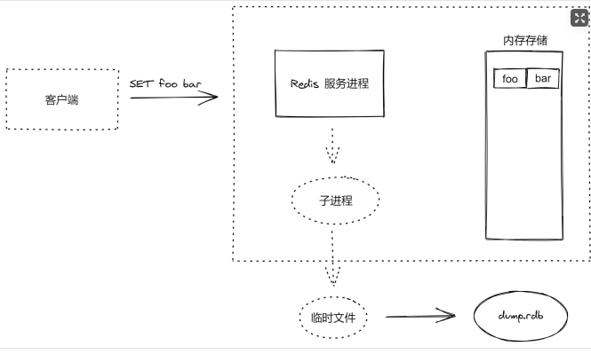

## 介绍
- Redis 是一个使用 C 编写的开源、支持网络、基于内存、可选持久性的键值对存储数据库。
- Redis 不是简单的 Key-Value 数据库，它还支持数据结构，例如
  - 字符串
  - 哈希
  - 列表
  - 集合
  - 带范围查询的排序集合
  - 位图
  - 超日志
  - 带有半径查询和流的地理空间索引
- Redis 具有内置的复制功能，解析执行 Lua 脚本，LRU 缓存控制，事务和不同级别的磁盘持久性

## 内存存储与持久化
- Redis 数据库中所有数据都存储在内存中。
- 相对于磁盘，内存的数据读/写速度要快得多，所以我们通常用 Redis 做缓存数据库。
- 在一台普通电脑上，Redis 可以在一秒内读写超过 10 万个键值。
- 将数据存储在内存中也有问题，比如程序退出后内存中的数据会丢失。
- 不过 Redis 提供了对持久化的支持，即可以将内存中的数据异步写入到硬盘中，同时不影响继续提供服务。

## 功能
- 作为缓存系统
  - Redis 可以为每个键设置生存时间，生存时间到期后会自动被删除。这一功能配合出色的性能让 Redis 可以作为缓存来使用。作为缓存系统，Redis 还可以限定数据占用的最大空间，在数据达到空间限制后可以按照一定的规则自动淘汰不需要的键。
- 作为队列系统
  - 除此之外，Redis 的列表类型键可以用来实现队列，并且支持阻塞式读取，可以很容易的实现一个高性能的优先级队列。
- “发布/订阅”功能
  - 同时在更高层面上，Redis 还支持“发布/订阅”的消息模式，可以基于此构建聊天室等系统。

## Redis 的特点
- 读写性能优异
- 持久化
- 数据类型丰富
- 单线程
- 数据自动过期
- 发布订阅
- 分布式


## 应用场景
- 缓存系统
  - 缓存现在几乎是所有中大型网站都在用的必杀技，合理的利用缓存不仅能够提升网站访问速度，还能大大降低数据库的压力。Redis 提供了键过期功能，也提供了灵活的键淘汰策略，所以，现在 Redis 用在缓存的场合非常多。
- 排行榜
  - 很多网站都有排行榜应用的，如京东的月度销量榜单、商品按时间的上新排行榜等。Redis提供的有序集合数据类构能实现各种复杂的排行榜应用。
- 计数器
  - 什么是计数器，如电商网站商品的浏览量、视频网站视频的播放数等。为了保证数据实时效，每次浏览都得给+1，并发量高时如果每次都请求数据库操作无疑是种挑战和压力。Redis提供的incr命令来实现计数器功能，内存操作，性能非常好，非常适用于这些计数场景。
- 分布式会话
  - 集群模式下，在应用不多的情况下一般使用容器自带的session复制功能就能满足，当应用增多相对复杂的系统中，一般都会搭建以Redis等内存数据库为中心的session服务，session不再由容器管理，而是由session服务及内存数据库管理。
- 分布式锁
  - 在很多互联网公司中都使用了分布式技术，分布式技术带来的技术挑战是对同一个资源的并发访问，如全局ID、减库存、秒杀等场景，并发量不大的场景可以使用数据库的悲观锁、乐观锁来实现，但在并发量高的场合中，利用数据库锁来控制资源的并发访问是不太理想的，大大影响了数据库的性能。可以利用Redis的setnx功能来编写分布式的锁，如果设置返回1说明获取锁成功，否则获取锁失败，实际应用中要考虑的细节要更多
- 社交网络
  - 点赞、踩、关注/被关注、共同好友等是社交网站的基本功能，社交网站的访问量通常来说比较大，而且传统的关系数据库类型不适合存储这种类型的数据，Redis提供的哈希、集合等数据结构能很方便的的实现这些功能。
- 最新列表
  - Redis列表结构，LPUSH可以在列表头部插入一个内容ID作为关键字，LTRIM可用来限制列表的数量，这样列表永远为N个ID，无需查询最新的列表，直接根据ID去到对应的内容页即可。
- 消息系统
  - 消息队列是大型网站必用中间件，如 ActiveMQ、RabbitMQ、Kafka 等流行的消息队列中间件，主要用于业务解耦、流量削峰及异步处理实时性低的业务。Redis 提供了发布/订阅及阻塞队列功能，能实现一个简单的消息队列系统。另外，这个不能和专业的消息中间件相比。

## 字符串（String）
- 字符串类型是 Redis 中最基本的数据类型，也是其它数据类型的基础。
- 它能存储任何形式的字符串，包括二进制数据。
- 你可以用它存储用户的邮箱、JSON 化的对象，甚至是一张图片
- value 最多可以容纳数据大小为 512 MB

- 添加
```
# 设置指定 key 的值
SET key value

# 将给定 key 的值设为 value ，并返回 key 的旧值(old value)
GETSET key value

# 只有在 key 不存在时设置 key 的值
SETNX key value

# 同时设置一个或多个 key-value 对
MSET key value [key value ...]

# 同时设置一个或多个 key-value 对，当且仅当所有给定 key 都不存在
MSETNX key value [key value ...]

# 如果 key 已经存在并且是一个字符串， APPEND 命令将指定的 value 追加到该 key 原来值（value）的末尾。
APPEND key value
```

- 查询
```
# 获取指定 key 的值
GET key

# 返回 key 中字符串值的子字符
GETRANGE key start end

# 获取所有(一个或多个)给定 key 的值
MGET key [key ...]

# 返回 key 所储存的字符串值的长度。
STRLEN key

# 通用命令：查询集合中是否有指定的 key
EXISTS key [key ...]

# 通用命令，查询 key 的类型
TYPE key
```

- 修改
```
# 设置指定 key 的值
SET key value

# 将给定 key 的值设为 value ，并返回 key 的旧值(old value)
GETSET key value

# 如果 key 已经存在并且是一个字符串， APPEND 命令将指定的 value 追加到该 key 原来值（value）的末尾。
APPEND key value
```

- 删除
```
# 通用命令：删除1个或多个指定的 key
DEL key [key ...]
```

## 数字
- 数字以字符串的形式保存
```
# 将 key 中储存的数字值增一
INCR key

# 将 key 所储存的值加上给定的增量值（increment） 
INCRBY key increment

# 将 key 中储存的数字值减一
DECR key

# key 所储存的值减去给定的减量值（decrement）
DECRBY key decrement
```

## 哈希（Hash）
- 哈希（也叫散列）类型也是一种字典结构，其存储了字段和字段值的映射，但字符值只能是字符串，不能其它数据类型，换句话说，散列类型不能嵌套其它数据类型。一个哈希类型可以包含至少 232 - 1 个字段。

- 添加
```
# 将哈希表 key 中的字段 field 的值设为 value
HSET key field value [field value ...]

# 同时将多个 field-value (域-值)对设置到哈希表 key 中
HMSET key field value [field value ...]

# 只有在字段 field 不存在时，设置哈希表字段的值
HSETNX key field value
```

- 查询
```
# 获取所有哈希表中的字段
HKEYS key

# 获取哈希表中字段的数量
HLEN key

# 获取所有给定字段的值
HMGET key field1 [field2]

# 获取存储在哈希表中指定字段的值
HGET key field

# 获取在哈希表中指定 key 的所有字段和值
HGETALL key

# 查看哈希表 key 中，指定的字段是否存在
HEXISTS key field

# 获取哈希表中所有值
HVALS key

# 迭代哈希表中的键值对
HSCAN key cursor [MATCH pattern] [COUNT count]
```

- 修改
```
# 将哈希表 key 中的字段 field 的值设为 value
HSET key field value [field value ...]

# 为哈希表 key 中的指定字段的整数值加上增量 increment
HINCRBY key field increment
```

- 删除
```
# 删除一个或多个哈希表字段
HDEL key field1 [field2]

# 删除整个数据字段
DEL key [key ...]
```

## 列表（List）
- 列表类型类似于编程语言中的数组，可以存储一个有序的字符串列表，常用的操作就是向列表两端添加元素，或者获得列表的某一个片段。
- 列表类型内部使用双向链表实现的，所有向列表两端添加元素的时间复杂度为O(1)，获取越接近两端的元素速度就越快。这意味着即时是一个有几千万个元素的列表，获取头部或尾部的10条记录也是极快的（和从只有20个元素的列表中获取头部或尾部的10条记录的速度是一样的）。
- 不过使用链表的代价是通过索引访问元素比较慢。设想在 iPhone 发售当前有 1000 个人在商店排队购买，这时商家为了感谢大家的支持，决定奖励第486位的顾客异步免费的 iPhone。为了找到这第 486 位顾客，工作人员不得不从队首一个一个地数到 486 个人。但同时，无论队伍有多长，新来的人想加入队伍的话直接排到队尾就好了，和队伍里有多少人没有任何关系。这种情景与列表类型的特性很相似。
- 这种特性使列表类型能非常快速地完成关系数据库难以应付的场景：例如社交网站的新鲜事，我们关心的只是最新内容，使用列表类型存储，即使新鲜事的总数达到几千万个，获取其中最新的100条数据也是极快的。同样因为在两端插入记录的时间复杂度是O(1)，列表类型也适合用来记录日志，可以保证加入新日志的速度不会受到已有日志数量额影响。
- 一个列表最多可以包含 232 - 1 个元素 (4294967295, 每个列表超过40亿个元素)。

- 添加
```
# 将一个或多个值插入到列表头部
LPUSH key element [element ...]

# 在列表的元素前或者后插入元素
LINSERT key BEFORE|AFTER pivot value

# 将一个值插入到已存在的列表头部
LPUSHX key value

# 通过索引设置列表元素的值
LSET key index value

# 在列表中添加一个或多个值
RPUSH key value1 [value2]

# 为已存在的列表添加值
RPUSHX key value
```

- 查询
```
# 通过索引获取列表中的元素
LINDEX key index

# 获取列表长度
LLEN key

# 获取列表指定范围内的元素
LRANGE key start stop
```

- 删除
```
# 移出并获取列表的第一个元素
LPOP key

# 移出并获取列表的第一个元素， 如果列表没有元素会阻塞列表直到等待超时或发现可弹出元素为止
BLPOP key1 [key2 ] timeout

# 移出并获取列表的最后一个元素， 如果列表没有元素会阻塞列表直到等待超时或发现可弹出元素为止
BRPOP key1 [key2 ] timeout

# 从列表中弹出一个值，将弹出的元素插入到另外一个列表中并返回它； 如果列表没有元素会阻塞列表直到等待超时或发现可弹出元素为止
BRPOPLPUSH source destination timeout

# 移除列表元素
# 如果 count > 0，则从头向尾遍历删除元素
# 如果 count < 0，则从后面向前面删除元素
# 如果 count = 0，则删除所有匹配的元素
LREM key count value

# 对一个列表进行修剪(trim)，就是说，让列表只保留指定区间内的元素，不在指定区间之内的元素都将被删除
LTRIM key start stop

# 移除列表的最后一个元素，返回值为移除的元素
RPOP key

# 移除列表的最后一个元素，并将该元素添加到另一个列表并返回
RPOPLPUSH source destination
```

## 集合（Set）
- 集合类型和数学中的集合概念相似，集合中的元素是唯一的、无序的，简单理解集合就是没有顺序且不重复的列表。
- 一个集合类型可以存储至多 232 - 1 个字符串
- 集合类型和列表类型有相似之处，它们的主要区别是：
  - 列表是有序的，集合是无序的
  - 列表数据可以重复，集合中没有重复数据
- 集合类型的常用操作是向集合中加入或删除元素、判断某个元素是否存在等。由于集合类型在 Redis 内部是使用值为空的散列表实现的，所以这些操作的时间复杂度都是O(1)。
- 最方便的是多个集合之间还可以进行并集、交集和差集运算。
- 使用场景
  - 跟踪一些唯一性数据
    - 比如访问网站的唯一 IP 地址信息，每次访问网站的时候记录用户 IP 地址，SET 自动保证数据的唯一不重复
  - 充分利用 SET 聚合操作方便高效的特性，用于维护数据对象之间的关联关系
    - 比如所有购买A商品的客户 ID 存储到指定的 SET 中，所有购买B商品的客户 ID 存储到指定的 SET 中，如果我们想要获取有哪个客户同时购买了这两个商品，我们只需要使用交集操作就可以轻松的查出来


- 添加
```
# 向集合添加一个或多个成员
SADD key member1 [member2]
```

- 查询
```
# 返回集合中的所有成员
SMEMBERS key

# 获取集合的成员数
SCARD key

# 判断 member 元素是否是集合 key 的成员
SISMEMBER key member

# 返回集合中一个或多个随机数
SRANDMEMBER key [count]
```

- 删除
```
# 移除集合中一个或多个成员
SREM key member1 [member2]

# 移除并返回集合中的一个随机元素
SPOP key

# 将 member 元素从 source 集合移动到 destination 集合
SMOVE source destination member
```

- 集合间聚合运算
```
# 返回第一个集合与其他集合之间的差异。
SDIFF key1 [key2]

# 返回给定所有集合的交集
SINTER key1 [key2]

# 返回所有给定集合的并集
SUNION key1 [key2]

# 返回给定所有集合的差集并存储在 destination 中
SDIFFSTORE destination key1 [key2]

# 返回给定所有集合的交集并存储在 destination 中
SINTERSTORE destination key1 [key2]

# 所有给定集合的并集存储在 destination 集合中
SUNIONSTORE destination key1 [key2]
```

## 有序集合（Sorted Set）
- 有序集合是一种类似于集合和哈希之间的混合数据类型。
- 与集合一样，排序集合由唯一的非重复字符串元素组成
- 有序集合中的元素不排序，但有序集合中的每个元素都关联了一个分数（这就是为什么类型也类似于哈希，因为每个元素都映射到一个值）
- 虽然集合中每个元素都是不同的，但是它们的分数确可以相同

- 有序集合类型在某些方面和列表类型有些相似。
  - 相同点：
    - 两者都是有序的
    - 两者都可以获得某一范围的元素
  - 不同点：
    - 列表类型通过链表实现的，获取靠近两端的数据速度极快，而当元素增多后，访问中间数据的速度会较慢，所以它更适合实现如“新鲜事”或“日志”这样很少访问中间元素的应用
    - 有序集合类似是使用哈希表实现的，所以即使读取位于中间部分的数据速度也很快
    - 列表中不能简单的调整某个元素的位置，但是有序集合可以（通过更改元素的分数）
    - 有序集合要比列表类型更耗费内存

- 场景
  - 排行榜
    - 例如一个大型在线游戏的积分排行榜，每当玩家的分数发生变化时，可以执行 ZADD 命令更新玩家的分数，此后再通过 ZRANGE 命令获取积分 TOPTEN 的用户信息。当然我们也可以利用 ZRANK 命令通过 username 来获取玩家的排行信息。最后我们将组合使用 ZRANGE 和 ZRANK 命令快速的获取和某个玩家积分相近的其他用户的信息。
  - 微博热搜
    - 假设我们现在要获取热门的帖子或搜索，比如我们常用的微博热搜。首先，我们需要一个衡量的标准，定量的量度热搜的热门程度。假设我们有一个字段叫回复量，回复量越高就越热门。使用有序集合存储帖子 id 和回复量两个信息即可。

- 添加
```
# 向有序集合添加一个或多个成员，或者更新已存在成员的分数
ZADD key score member [score member ...]
```

- 查询
```
# 通过索引区间返回有序集合指定区间内的成员，分数从低到高排序
ZRANGE key start stop [WITHSCORES]

# 通过索引区间返回有序集合指定区间内的成员，分数从高到低排序
ZREVRANGE key start stop [WITHSCORES]

# 返回有序集中指定分数区间内的成员，分数从低到高排序
ZRANGEBYSCORE key min max [WITHSCORES] [LIMIT offset count]

# 返回有序集中指定分数区间内的成员，分数从高到低排序
ZREVRANGEBYSCORE key max min [WITHSCORES] [LIMIT offset count]

# 返回有序集合中指定成员的排名，有序集成员按分数值（从小到大）排序
ZRANK key member

# 返回有序集合中指定成员的排名，有序集成员按分数值（从大到小）排序
ZREVRANK key member

# 获取有序集合的成员数
ZCARD key

# 返回有序集中，成员的分数值
ZSCORE key member

# 计算在有序集合中指定区间分数的成员数
ZCOUNT key min max
```

- 修改
```
# 向有序集合添加一个或多个成员，或者更新已存在成员的分数
ZADD key score member [score member ...]

# 有序集合中对指定成员的分数加上增量 increment
ZINCRBY key increment member
```

- 删除
```
# 移除有序集合中的一个或多个成员
ZREM key member [member ...]

# 移除有序集合中给定的排名区间的所有成员
ZREMRANGEBYRANK key start stop

# 移除有序集合中给定的分数区间的所有成员
ZREMRANGEBYSCORE key min max
```

- 有序集合间聚合运算
```
# 计算给定的一个或多个有序集的交集并将结果集存储在新的有序集合 destination 中
ZINTERSTORE destination numkeys key [key ...]

# 计算给定的一个或多个有序集的并集，并存储在新的 key 中
ZUNIONSTORE destination numkeys key [key ...]
```

## 通用命令
```
# 返回所有 key
KEYS *

# 返回所有以 my 开头的 key
KEYS my*

# 获取 key 的类型
TYPE key

# 查询某个 key 是否存在
EXISTS key [key ...]

# 将 key 改名为 newkey
RENAME key newkey

# 删除指定 key
DEL key [key ...]

# 从当前数据库中随机返回(不删除)一个 key
RANDOMKEY

# 对 key 进行重命名
RENAME key newkey

# 清空当前数据库所有内容
FLUSHDB

# 清空所有数据库内容
FLUSHALL

# 将当前数据库的 key 移动到给定的数据库 db 当中
MOVE key db
```

## 过期时间
- 在实际开发中经常会遇到一些有时效的数据，比如限时优惠活动、缓存或验证码等，过了一定时间就需要删除这些数据。在关系数据库中一般需要额外的一个字段记录到期时间，然后定期检测删除过期数据。而在 Redis 中可以设置一个键的过期时间，到时间后 Redis 会自动删除它。
- 这4个命令只是单位和表现形式上的不同，但实际上 EXPIRE、PEXPIRE 以及 EXPIREAT 命令的执行最后都会使用 PEXPIREAT 来实行。
- 给键设置了过期时间，这个时间保存在一个字典里，也是键值结构，键是一个指针，指向真实的键，而值这是一个长整型的 UNIX 时间。

- 设置键的过期时间
```
# 为给定 key 设置生存时间，当 key 过期时(生存时间为 0 )，它会被自动删除。
EXPIRE key seconds

# 和 EXPIRE 一样，但是它以毫秒为单位
PEXPIRE key milliseconds

# EXPIREAT 的作用和 EXPIRE 类似，都用于为 key 设置生存时间。
# 不同在于 EXPIREAT 命令接受的时间参数是 UNIX 时间戳(unix timestamp)。
EXPIREAT key timestamp

# 这个命令和 EXPIREAT 命令类似，但它以毫秒为单位设置 key 的过期 unix 时间戳，而不是像 EXPIREAT 那样，以秒为单位。
PEXPIREAT key milliseconds-timestamp
```

- 获取键的过期时间
- -2	过期且已删除
- -1	没有过期时间设置，即永不过期
- >0	表示距离过期还有多少秒或者毫秒
```
# 以秒为单位，返回给定 key 的剩余生存时间(TTL, time to live)。
TTL key

# 类似于 TTL，但它以毫秒为单位返回 key 的剩余生存时间。
PTTL key
```

- 清除键的过期时间
- 使用 SET 或 GETSET 命令为键赋值也会同时清除键的过期时间。
- 其它只对键值进行操作的命令（如 INCR、LPUSH、HSET、ZREM）不会影响键的过期时间。
```
# 移除给定 key 的生存时间，将这个 key 从『易失的』(带生存时间 key )转换成『持久的』(一个不带生存时间、永不过期的 key )。
PERSIST key
```

## 事务
关于事务最常见的例子就是银行转账，A 账户给 B 账户转账一个亿 (T1)，买一块地盖房子。在这种交易的过程中，有几个问题值得思考：

• 如何同时保证上述交易中，A账户总金额减少一个亿，B账户总金额增加一个亿？ A

• A账户如果同时在和C账户交易(T2)，如何让这两笔交易互不影响？ I

• 如果交易完成时数据库突然崩溃，如何保证交易数据成功保存在数据库中？ D

• 如何在支持大量交易的同时，保证数据的合法性(没有钱凭空产生或消失) ？ C

要保证交易正常可靠地进行，数据库就得解决上面的四个问题，这也就是事务诞生的背景，它能解决上面的四个问题，对应地，它拥有四大特性（ACID）

- 原子性（Atomicity）: 事务要么全部完成，要么全部取消。 如果事务崩溃，状态回到事务之前（事务回滚）。
确保不管交易过程中发生了什么意外状况（服务器崩溃、网络中断等），不能出现A账户少了一个亿，但B账户没到帐，或者A账户没变，但B账户却凭空收到一个亿（数据不一致）。A和B账户的金额变动要么同时成功，要么同时失败(保持原状)。
- 隔离性（Isolation）: 如果2个事务 T1 和 T2 同时运行，事务 T1 和 T2 最终的结果是相同的，不管 T1和T2谁先结束。
如果A在转账1亿给B（T1），同时C又在转账3亿给A（T2），不管T1和T2谁先执行完毕，最终结果必须是A账户增加2亿，而不是3亿，B增加1亿，C减少3亿。
- 持久性（Durability）: 一旦事务提交，不管发生什么（崩溃或者出错），数据要保存在数据库中。
确保如果 T1 刚刚提交，数据库就发生崩溃，T1执行的结果依然会保持在数据库中。
- 一致性（Consistency）: 只有合法的数据（依照关系约束和函数约束）才能写入数据库。
确保钱不会在系统内凭空产生或消失， 依赖原子性和隔离性。

```
# 标记一个事务块的开始
# 事务块内的多条命令会按照先后顺序被放进一个队列当中，最后由 EXEC 命令原子性(atomic)地执行
MULTI

# 执行所有事务块内的命令。
EXEC

# 取消事务，放弃执行事务块内的所有命令。
DISCARD
```
- Redis 保证了一个事务中的所有命令要么都执行，要么都不执行。如果在发送 EXEC 命令前客户端掉线了，则 Redis 会清空事务队列，事务中的所有命令都不会执行。而一旦客户端发送了 EXEC 命令，所有的命令就都会被执行，即使此后客户端断线也没关系，因为 Redis 中已经记录了所有要执行的命令。
- 除此之外，Redis 的事务还能保证一个事务内的命令依次执行而不被其它命令插入。

- 事务的错误处理
  - 只要有一个命令有语法错误，执行 EXEC 命令后 Redis 就会直接返回错误，连语法正确的命令也不会执行。
  - 运行错误。运行错误指在命令执行时出现的错误，比如使用散列类型的命令操作集合类型的键，这种错误在实际执行之前 Redis 是无法发现的，所以在事务里这样的命令是会被 Redis 接受并执行的。如果事务里的一条命令出现了运行错误，事务里其它的命令依然会继续执行。
  - Redis 事务没有关系数据库事务提供的回滚（rollback）功能。为此开发者必须在事务执行出错后自己收拾剩下的摊子（将数据库复原回事务执行前的状态等）。

- Watch 命令
  - WATCH 定义：监视一个(或多个) key ，如果在事务执行之前这个(或这些) key 被其他命令所改动，那么事务将被打断。
```
# 监视一个(或多个) key ，如果在事务执行之前这个(或这些) key 被其他命令所改动，那么事务将被打断。
WATCH key [key ...]

# 取消 WATCH 命令对所有 key 的监视。
# 如果在执行 WATCH 命令之后， EXEC 命令或 DISCARD 命令先被执行了的话，那么就不需要再执行 UNWATCH 了。
UNWATCH
```

## Redis 持久化
- RDB 持久化，根据指定的规则“定时”将内存中的数据存储在硬盘上，在重启之后读取硬盘上的 .rdb 快照文件将数据恢复到内存中。
- AOF 持久化：AOF 持久化记录服务器执行的所有写操作命令形成 .aof 日志文件保存到硬盘中，并在服务器启动时，通过重新执行这些命令来还原数据集。

### RDB
- Redis 允许用户自定义快照条件，当符合快照条件时，Redis 会自动执行快照操作。进行快照的条件可以由用户在配置文件中自定义，由两个参数构成：时间窗口 M 和改动的键的个数  N。每当时间 M 内被更改的键的个数大于 N 时，即符合自动快照条件
```
RDB 持久化相关配置规则

save 900 1 # 每 900 秒至少有 1 个 key 变化了，则写入快照
save 300 10 # 每 300 秒至少有 10 个 key 变化了，则写入快照
save 60 10000 # 每 60 秒至少有 10000 个 key 变化了，则写入快照

dbfilename dump.rdb # 快照保存的文件名称

dir ./ # 快照文件保存路径
```
- RDB 快照的运行方式是异步进行的，在保存快照期间依然能够提供客户端请求
- Redis 调用 fork() 创建一个子进程
- 使用子进程将数据集写入到一个临时 RDB 文件中
- 当子进程完成对新 RDB 文件的写入时，Redis 用新 RDB 文件替换原来的 RDB 文件，并删除旧的 RDB 文件
- 
  
### AOF
- 快照功能并不是非常持久（durable）： 如果 Redis 因为某些原因而造成故障停机， 那么服务器将丢失最近写入、且仍未保存到快照中的那些数据。
- AOF 可以将 Redis 执行的每一条写命令操作日志存储到硬盘文件中，这一过程显然会降低 Redis 的性能，但是大部分情况下这个影响是可以接受的，另外使用较快硬盘可以提供 AOF 性能。
- AOF 机制对于日志的写入操作采用的是 append 模式，就是追加模式，因此在写入过程中如果出现宕机问题，也不会破坏已经写入的日志数据。
```
AOF 持久化

# 通过 appendonly 开启 AOF 持久化
appendonly yes

# AOF 文件和 RDB 文件保存目录是一样的
dir ./

# 同步的文件名称
appendfilename "appendonly.aof"

# 三种同步策略
# 每修改同步，每一次发送数据变化都会被立即同步到磁盘中，效率比较低，但是数据最安全
appendfsync always

# 默认值，每秒同步，异步完成，同步效率非常高，缺点是一旦系统出现宕机，这1秒之内操作的数据就会丢失
appendfsync everysec

# 不同步
appendfsync no
```

### 对比

RDB
文件小
异步备份，性能好
恢复大数据集速度比 AOF 快
数据安全性低，容易丢失数据
数据量比较大时备份速度慢

AOF
数据安全性高
有利于开发分析
相同数据集比 RDB 文件大
根据所使用的 fsync 策略，AOF 速度可能会慢于 RDB
